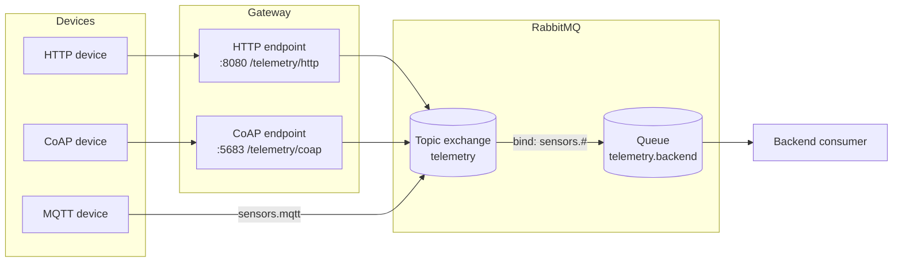

# IoT Protocol Comparison Lab

This lab compares three edge communication styles for an IoT agriculture scenario:

- MQTT for lightweight publish/subscribe telemetry and alerts.
- HTTP for simple request/response device uploads.
- CoAP for constrained-device telemetry over a web-like resource model.

RabbitMQ sits behind the gateway as asynchronous backend middleware. The gateway normalizes HTTP and CoAP payloads and publishes them to a RabbitMQ topic exchange. The MQTT device path can publish directly into RabbitMQ through the MQTT plugin, using the same exchange model on the backend.

## Architecture

## Run

1. Start the stack with `docker compose up -d`.
2. Send HTTP telemetry with `uv run device/http.py --count 1`.
3. Send MQTT telemetry with `python3 device/mqtt.py --count 1` after installing `pip install -r device/requirements.txt`.
4. Send CoAP telemetry with `python3 device/coap.py --count 1` after installing `pip install -r device/requirements.txt`.

## Protocol roles

- HTTP: easiest for direct backend integration, but synchronous and request-driven.
- MQTT: best fit for lightweight device telemetry and alerts because it is publish/subscribe.
- CoAP: good for constrained nodes and lossy networks when the device needs a minimal web-style protocol.

## RabbitMQ role

RabbitMQ decouples device ingestion from backend processing. The gateway and MQTT path publish messages into a topic exchange, and the backend consumer processes them asynchronously through a queue binding.