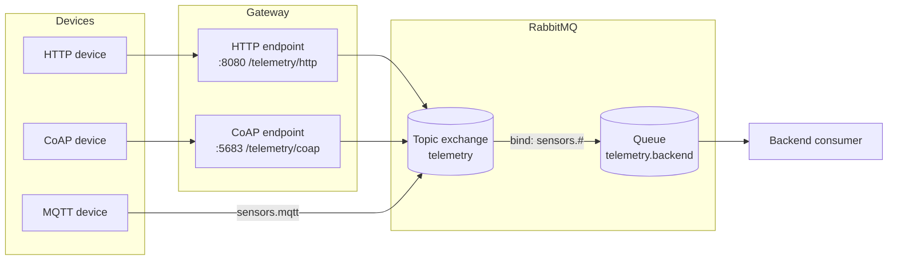

# IoT Protocol Comparison Lab

This lab compares three edge communication styles for an IoT agriculture scenario:

- MQTT for lightweight publish/subscribe telemetry and alerts.
- HTTP for simple request/response device uploads.
- CoAP for constrained-device telemetry over a web-like resource model.

RabbitMQ sits behind the gateway as asynchronous backend middleware. The gateway normalizes HTTP and CoAP payloads and publishes them to a RabbitMQ topic exchange. The MQTT device path can publish directly into RabbitMQ through the MQTT plugin, using the same exchange model on the backend.

## Architecture

## Run

1. Start the stack with `docker compose up -d`.
2. Send HTTP telemetry with `uv run device/http.py --count 1`.
3. Send MQTT telemetry with `python3 device/mqtt.py --count 1` after installing `pip install -r device/requirements.txt`.
4. Send CoAP telemetry with `python3 device/coap.py --count 1` after installing `pip install -r device/requirements.txt`.

## Protocol roles

- HTTP: easiest for direct backend integration, but synchronous and request-driven.
- MQTT: best fit for lightweight device telemetry and alerts because it is publish/subscribe.
- CoAP: good for constrained nodes and lossy networks when the device needs a minimal web-style protocol.

## RabbitMQ role

RabbitMQ decouples device ingestion from backend processing. The gateway and MQTT path publish messages into a topic exchange, and the backend consumer processes them asynchronously through a queue binding.

## Task
  Done

  - Task 1: Communication model and architecture: partially done in README.md:11. It has a Mermaid diagram and protocol
  roles.
  - Task 2: HTTP device path: done. HTTP simulator exists in device/http.py:1, and gateway handles POST /telemetry/http
  in gateway/main.py:66.
  - Task 3: MQTT device path: done. MQTT simulator publishes to sensors.mqtt in device/mqtt.py:1. RabbitMQ MQTT plugin
  is enabled in infra/rabbitmq/enabled_plugins:1, and MQTT maps to exchange telemetry in infra/rabbitmq/rabbitmq.conf:2.
  - Task 4: CoAP device path: done. CoAP simulator exists in device/coap.py:1, and the gateway exposes /telemetry/coap
  in gateway/main.py:81.
  - Task 5: Deploy RabbitMQ: done in code/config. Docker Compose defines RabbitMQ, gateway, and backend in docker-
  compose.yaml:1. Backend declares exchange, queue, binding, and consumes messages in backend/consumer.py:35.

  Not Fully Done / Missing

  - Task 6: Protocol comparison is not complete. README.md:46 has only a short “Protocol roles” section. The lab
  requires comparison across communication model, ease of implementation, constrained-device suitability, telemetry,
  alerts, backend integration, and async architecture.
  - Task 7: RabbitMQ role explanation is too short. README.md:52 mentions decoupling, but it does not explain buffering,
  fan-out/multi-consumer support, workflow separation, exchanges, queues, and bindings in enough detail.
  - Report deliverables are missing. I do not see a full report file with screenshots/logs, protocol path descriptions,
  observed behavior, final decision, and demo evidence.
  - Screenshots or captured logs are missing. The code can print messages, but there are no saved logs or screenshots in
  the repo showing successful HTTP/MQTT/CoAP message flow.
  - Urgent event/alert behavior is not implemented separately. The simulators send periodic telemetry values, but there
  is no clear abnormal event example like temperature_too_high or water_level_low.
  - Mermaid diagram may still fail in strict renderers because README.md:22 uses \n inside labels and README.md:36 uses
  sensors.#.