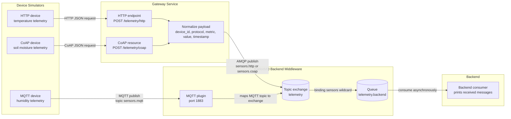

# Protocol Selection for IoT Systems: Comparing MQTT, HTTP, and CoAP at the Edge, with RabbitMQ in the Backend

## 1. Introduction

This lab compares three communication approaches for an IoT-style smart agriculture system: MQTT, HTTP, and CoAP. The purpose is to decide which protocol is most suitable between edge devices and the gateway, and to explain why RabbitMQ is useful behind the gateway for backend message processing.

In this prototype, sensor devices send telemetry such as temperature, humidity, and soil moisture. The system supports multiple communication styles:

- HTTP devices send telemetry using a request/response API.
- MQTT devices publish telemetry using a publish/subscribe model.
- CoAP devices send constrained telemetry to a CoAP resource.
- RabbitMQ receives normalized messages and routes them to a backend consumer asynchronously.

RabbitMQ is not treated as an IoT edge protocol. It is used as backend middleware to decouple message ingestion from backend processing.

## 2. Objective

The objective of this lab is to compare MQTT, HTTP, and CoAP for edge communication in an IoT system, then use RabbitMQ as backend middleware for asynchronous processing.

The prototype demonstrates this architecture:

```text
Device simulator -> Edge protocol -> Gateway or RabbitMQ MQTT endpoint -> RabbitMQ -> Backend consumer
```

The final engineering decision is based on the implementation behavior and the suitability of each protocol for smart agriculture telemetry and alerts.

## 3. Scenario

The scenario is a smart agriculture monitoring system. Several edge devices periodically send sensor data:

- temperature
- humidity
- soil moisture

The system may also need to send urgent events, such as high temperature or low water level. The backend should process incoming data asynchronously, so devices do not need to wait for database writes, alert logic, or dashboard updates to finish.

## 4. Implemented Architecture



## 5. Communication Model

### HTTP Path

HTTP uses a request/response model. The HTTP device sends a JSON payload to the gateway using `POST /telemetry/http`. The gateway accepts the request, normalizes the payload, and publishes it to RabbitMQ using AMQP.

Flow:

```text
HTTP device -> Gateway HTTP endpoint -> RabbitMQ topic exchange -> Queue -> Backend consumer
```

Implemented files:

- `device/http.py`
- `gateway/main.py`
- `backend/consumer.py`

Example HTTP telemetry payload:

```json
{
  "device_id": "http-device-1",
  "metric": "temperature",
  "value": 20,
  "timestamp": "2026-05-09T00:00:00Z"
}
```

The gateway publishes the normalized message with the routing key:

```text
sensors.http
```

### MQTT Path

MQTT uses a publish/subscribe model. The MQTT device publishes telemetry directly to RabbitMQ using the MQTT plugin. RabbitMQ maps the MQTT topic into its internal topic exchange model.

Flow:

```text
MQTT device -> RabbitMQ MQTT plugin -> RabbitMQ topic exchange -> Queue -> Backend consumer
```

Implemented files:

- `device/mqtt.py`
- `infra/rabbitmq/enabled_plugins`
- `infra/rabbitmq/rabbitmq.conf`
- `backend/consumer.py`

Example MQTT topic:

```text
sensors.mqtt
```

Example MQTT telemetry payload:

```json
{
  "device_id": "mqtt-device-1",
  "protocol": "mqtt",
  "metric": "humidity",
  "value": 55,
  "timestamp": "2026-05-09T00:00:00Z"
}
```

### CoAP Path

CoAP uses a lightweight request/response model designed for constrained devices and constrained networks. The CoAP device sends a JSON payload to the gateway's CoAP resource. The gateway normalizes the payload and publishes it to RabbitMQ.

Flow:

```text
CoAP device -> Gateway CoAP resource -> RabbitMQ topic exchange -> Queue -> Backend consumer
```

Implemented files:

- `device/coap.py`
- `gateway/main.py`
- `backend/consumer.py`

Example CoAP resource:

```text
coap://localhost:5683/telemetry/coap
```

Example CoAP telemetry payload:

```json
{
  "device_id": "coap-device-1",
  "metric": "soil_moisture",
  "value": 40,
  "timestamp": "2026-05-09T00:00:00Z"
}
```

The gateway publishes the normalized message with the routing key:

```text
sensors.coap
```

## 6. RabbitMQ Backend Design

RabbitMQ is used as backend middleware. It receives messages from the gateway or the MQTT plugin, routes them through a topic exchange, stores them in a durable queue, and delivers them to a backend consumer.

RabbitMQ ports used in this project:

| Port | Purpose |
|---:|---|
| 5672 | AMQP communication between gateway/backend and RabbitMQ |
| 1883 | MQTT communication through RabbitMQ MQTT plugin |
| 15672 | RabbitMQ management UI |

RabbitMQ configuration:

```text
Exchange: telemetry
Exchange type: topic
Queue: telemetry.backend
Queue binding: sensors wildcard
```

In the code, the backend consumer binds the queue using:

```text
sensors.#
```

This means the backend receives messages with routing keys such as:

```text
sensors.http
sensors.coap
sensors.mqtt
```

RabbitMQ solves several backend architecture problems:

- **Decoupling**: devices and gateways do not directly depend on backend processing logic.
- **Asynchronous processing**: backend services can process messages after they are accepted.
- **Buffering**: messages can wait in a queue if the consumer is temporarily busy.
- **Routing**: exchanges and routing keys control which queues receive which messages.
- **Multi-consumer support**: more queues and consumers can be added later for dashboard, alerting, or storage.
- **Workflow separation**: ingestion is separated from business logic.

## 7. Running the Prototype

Start the stack:

```bash
docker compose up -d
```

Send HTTP telemetry:

```bash
python3 device/http.py --count 1
```

Send MQTT telemetry:

```bash
python3 device/mqtt.py --count 1
```

Send CoAP telemetry:

```bash
python3 device/coap.py --count 1
```

Check backend logs:

```bash
docker compose logs backend
```

Open RabbitMQ management UI:

```text
http://localhost:15672
```

## 8. Evidence of Message Flow

The backend consumer prints each received message. A successful message looks like this:

```text
[backend] message received
{
  "device_id": "http-device-1",
  "metric": "temperature",
  "protocol": "http",
  "routing_key": "sensors.http",
  "source_ip": "172.x.x.x",
  "timestamp": "2026-05-09T00:00:00Z",
  "value": 20
}
[backend] ---
```

Expected MQTT output from the device simulator:

```text
published to sensors.mqtt: {"device_id": "mqtt-device-1", "protocol": "mqtt", "metric": "humidity", "value": 55, "timestamp": "2026-05-09T00:00:00Z"}
```

Expected CoAP response from the gateway:

```json
{
  "status": "stored",
  "message": {
    "device_id": "coap-device-1",
    "protocol": "coap",
    "metric": "soil_moisture",
    "value": 40,
    "routing_key": "sensors.coap"
  }
}
```

Screenshots or logs to include in the final submission:

- RabbitMQ management UI showing the `telemetry.backend` queue.
- Backend logs showing messages received from HTTP.
- Backend logs showing messages received from MQTT.
- Backend logs showing messages received from CoAP.

## 9. Protocol Comparison

| Dimension | HTTP | MQTT | CoAP |
|---|---|---|---|
| Communication model | Request/response | Publish/subscribe | Request/response |
| Transport style | Usually TCP | TCP with long-lived connection | Usually UDP |
| Ease of implementation | Easiest because HTTP tools are common | Moderate because broker/topic setup is needed | Moderate because CoAP tools are less common |
| Suitability for constrained devices | Acceptable, but heavier than MQTT or CoAP | Very good for low-bandwidth telemetry | Very good for constrained and lossy networks |
| Fit for periodic telemetry | Works, but each request is direct and synchronous | Very good because devices can publish small messages repeatedly | Good for small constrained telemetry |
| Fit for urgent events | Works if gateway is reachable | Very good because event messages can be published immediately | Good, especially in constrained networks |
| Direct web/backend integration | Excellent | Requires MQTT broker or MQTT-aware service | Less common in normal web backends |
| Fit for async backend architecture | Needs gateway to publish into broker | Natural fit with broker-based routing | Needs gateway to publish into broker |
| Developer familiarity | Very high | Medium | Lower |
| Best use in this lab | Simple device upload path | Main IoT telemetry and alert path | Constrained-device path |

## 10. Observed Behavior

HTTP was the simplest protocol to implement and test. The device simulator sends a JSON request and receives a response from the gateway. This makes HTTP convenient for simple integrations, but it also shows that HTTP is naturally request-driven.

MQTT fit the telemetry scenario well because the device publishes to a topic and does not need to know about the backend consumer. RabbitMQ's MQTT plugin allowed the MQTT device to publish directly to the broker, and the backend consumed the message through the same queue model as other protocols.

CoAP showed a lightweight request/response style for constrained telemetry. It is less familiar than HTTP, but it is designed for constrained devices and networks. In this prototype, the CoAP path still uses the gateway to normalize and forward messages into RabbitMQ.

RabbitMQ made the backend asynchronous. The backend consumer receives messages from a queue instead of being called directly by the devices. This means the backend can be restarted or scaled separately from the device ingestion logic.

## 11. RabbitMQ Role Explanation

RabbitMQ is included to demonstrate backend decoupling. The gateway does not directly call a database, dashboard, or alerting service. Instead, it publishes messages to a RabbitMQ exchange. RabbitMQ then routes those messages to a queue based on bindings.

The backend consumer reads from the queue and processes messages independently. This is useful because IoT systems often have bursts of device messages. If the backend is temporarily slow, messages can remain in the queue instead of forcing devices to wait for full processing.

RabbitMQ also makes it possible to add more backend workflows later. For example:

- one queue for storage
- one queue for alerting
- one queue for dashboard updates
- one queue for analytics

This allows the system to grow without changing every device simulator.

## 12. Final Engineering Decision

For this smart agriculture scenario, MQTT is the best default protocol for device-to-gateway telemetry and urgent event messages. It is lightweight, uses publish/subscribe communication, and matches the behavior of devices that periodically send small sensor values.

HTTP is still useful when simple compatibility with web APIs is the priority. It is easy to implement, easy to debug, and familiar to developers, but it is not the best choice for constrained IoT telemetry because it is request/response oriented and usually heavier than MQTT.

CoAP is a good choice for constrained devices and lossy networks. It is especially useful when devices need HTTP-like resource semantics with lower overhead. However, it is less common in normal backend systems, so a gateway is useful for translating CoAP messages into backend messaging.

RabbitMQ should be used behind the gateway as backend middleware. It should not be confused with the edge protocol decision. Its main role is to route, buffer, and deliver messages asynchronously to backend consumers.

Recommended final architecture:

```text
MQTT or CoAP for constrained edge devices
HTTP for simple web-compatible devices
RabbitMQ for backend asynchronous processing
```

## 13. Demo Checklist

During the live demo, show the following:

1. Start RabbitMQ, gateway, and backend:

   ```bash
   docker compose up -d
   ```

2. Show RabbitMQ management UI:

   ```text
   http://localhost:15672
   ```

3. Show backend consumer logs:

   ```bash
   docker compose logs -f backend
   ```

4. Send HTTP telemetry:

   ```bash
   python3 device/http.py --count 1
   ```

5. Send MQTT telemetry:

   ```bash
   python3 device/mqtt.py --count 1
   ```

6. Send CoAP telemetry:

   ```bash
   python3 device/coap.py --count 1
   ```

7. Explain the result:

   - HTTP is simple request/response.
   - MQTT is best for publish/subscribe telemetry.
   - CoAP is suitable for constrained networks.
   - RabbitMQ decouples ingestion from backend processing.

