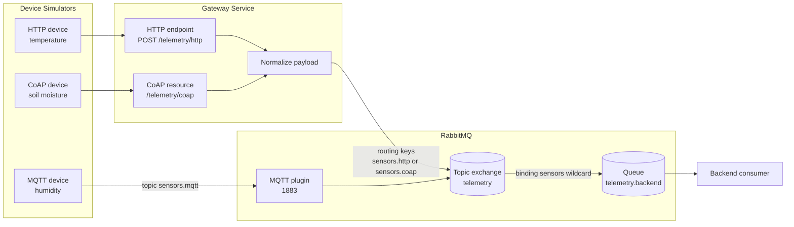

# Task Answers

## Task 1. Define the Communication Model

This project uses three edge communication models for the smart agriculture system: HTTP, MQTT, and CoAP.

The overall system flow is:

```text
Device simulator -> Edge protocol -> Gateway or RabbitMQ MQTT endpoint -> RabbitMQ -> Backend consumer
```

HTTP and CoAP devices communicate with the gateway. The gateway receives the telemetry, normalizes the message format, and publishes it into RabbitMQ. The MQTT device publishes directly to RabbitMQ through the RabbitMQ MQTT plugin.



Communication models:

| Protocol | Model | Used for |
|---|---|---|
| HTTP | Request/response | Simple telemetry upload to gateway |
| MQTT | Publish/subscribe | Lightweight telemetry and event publishing |
| CoAP | Lightweight request/response | Constrained device telemetry |
| RabbitMQ | Backend message broker | Asynchronous routing and queueing |

The normalized message format is:

```json
{
  "device_id": "sensor-device",
  "protocol": "http",
  "metric": "temperature",
  "value": 25,
  "timestamp": "2026-05-09T00:00:00Z",
  "routing_key": "sensors.http"
}
```

## Task 2. Implement an HTTP Device Path

The HTTP device path is implemented.

Flow:

```text
HTTP device -> Gateway HTTP endpoint -> RabbitMQ -> Backend consumer
```

The HTTP device simulator is implemented in:

```text
device/http.py
```

It sends JSON telemetry using an HTTP `POST` request to:

```text
http://localhost:8080/telemetry/http
```

Example telemetry:

```json
{
  "device_id": "http-device-1",
  "metric": "temperature",
  "value": 20,
  "timestamp": "2026-05-09T00:00:00Z"
}
```

The gateway receives the request in `gateway/main.py`, normalizes the payload, adds the protocol value `http`, and publishes the message to the RabbitMQ topic exchange using the routing key:

```text
sensors.http
```

Run command:

```bash
python3 device/http.py --count 1
```

Expected result:

```text
HTTP device sends telemetry
Gateway returns status stored
Backend consumer prints the received message
```

This path shows that HTTP is simple and easy to test, but it is request/response based. The device sends a request and waits for the gateway response.

## Task 3. Implement an MQTT Device Path

The MQTT device path is implemented.

Flow:

```text
MQTT device -> RabbitMQ MQTT plugin -> RabbitMQ exchange -> Backend consumer
```

The MQTT device simulator is implemented in:

```text
device/mqtt.py
```

It publishes telemetry to the MQTT topic:

```text
sensors.mqtt
```

RabbitMQ MQTT support is enabled in:

```text
infra/rabbitmq/enabled_plugins
```

The MQTT plugin is configured to publish into the RabbitMQ exchange:

```text
telemetry
```

This is configured in:

```text
infra/rabbitmq/rabbitmq.conf
```

Example telemetry:

```json
{
  "device_id": "mqtt-device-1",
  "protocol": "mqtt",
  "metric": "humidity",
  "value": 55,
  "timestamp": "2026-05-09T00:00:00Z"
}
```

Run command:

```bash
python3 device/mqtt.py --count 1
```

Expected result:

```text
MQTT device publishes to sensors.mqtt
RabbitMQ MQTT plugin receives the message
RabbitMQ routes it through the telemetry exchange
Backend consumer receives the message from telemetry.backend queue
```

This path shows the publish/subscribe model. The MQTT device does not call the backend directly. It publishes to a topic, and RabbitMQ handles delivery to the backend queue.

## Task 4. Implement a CoAP Device Path

The CoAP device path is implemented.

Flow:

```text
CoAP device -> Gateway CoAP resource -> RabbitMQ -> Backend consumer
```

The CoAP device simulator is implemented in:

```text
device/coap.py
```

It sends telemetry to:

```text
coap://localhost:5683/telemetry/coap
```

The gateway exposes the CoAP resource in:

```text
gateway/main.py
```

Example telemetry:

```json
{
  "device_id": "coap-device-1",
  "metric": "soil_moisture",
  "value": 40,
  "timestamp": "2026-05-09T00:00:00Z"
}
```

The gateway normalizes the message, adds the protocol value `coap`, and publishes it to RabbitMQ using the routing key:

```text
sensors.coap
```

Run command:

```bash
python3 device/coap.py --count 1
```

Expected result:

```text
CoAP device sends telemetry
Gateway responds with status stored
Backend consumer receives the message from RabbitMQ
```

This path shows how CoAP can support lightweight constrained-device communication while still using RabbitMQ for backend processing.

## Task 5. Deploy RabbitMQ

RabbitMQ is deployed using Docker Compose.

The deployment is defined in:

```text
docker-compose.yaml
```

RabbitMQ exposes these ports:

| Port | Purpose |
|---:|---|
| 5672 | AMQP connection for gateway and backend |
| 1883 | MQTT connection for MQTT devices |
| 15672 | RabbitMQ management UI |

Run command:

```bash
docker compose up -d
```

The backend consumer declares:

```text
Exchange: telemetry
Exchange type: topic
Queue: telemetry.backend
Binding: sensors.#
```

The binding `sensors.#` allows the backend queue to receive messages from:

```text
sensors.http
sensors.mqtt
sensors.coap
```

The backend consumer is implemented in:

```text
backend/consumer.py
```

It receives messages asynchronously from RabbitMQ and prints them.

This satisfies the requirement that device messages are not processed only in a tightly coupled synchronous manner. RabbitMQ stores and routes the messages before the backend consumer processes them.

## Task 6. Compare the Protocols

| Dimension | HTTP | MQTT | CoAP |
|---|---|---|---|
| Communication model | Request/response | Publish/subscribe | Request/response |
| Main use in project | Device posts telemetry to gateway | Device publishes telemetry to topic | Device sends telemetry to CoAP resource |
| Ease of implementation | Easiest | Moderate | Moderate |
| Backend integration | Very easy with web APIs | Requires broker or MQTT service | Usually needs gateway translation |
| Constrained-device suitability | Acceptable, but heavier | Very good | Very good |
| Telemetry suitability | Good for simple uploads | Excellent for frequent telemetry | Good for constrained telemetry |
| Alert/event suitability | Works, but request-driven | Excellent for event publishing | Good for constrained event messages |
| Asynchronous backend fit | Needs gateway to publish to RabbitMQ | Natural fit with broker-based routing | Needs gateway to publish to RabbitMQ |
| Developer familiarity | High | Medium | Lower |

Based on the implementation, HTTP was the easiest to build and test because it uses common web request patterns. It is useful for simple device-to-gateway uploads, but the device waits for the gateway response.

MQTT was the best fit for telemetry and urgent events because the device only publishes to a topic. The device does not need to know which backend service consumes the message. This matches IoT communication well.

CoAP was useful for showing constrained-device communication. It is lighter than HTTP and suitable for constrained networks, but it is less common in normal backend systems, so the gateway is useful for translating CoAP into RabbitMQ messages.

Final comparison decision:

```text
MQTT is best for regular IoT telemetry and urgent events.
HTTP is best for simple integration and testing.
CoAP is best for constrained or lossy network environments.
```

## Task 7. Explain RabbitMQ's Role

RabbitMQ is used as backend middleware. It is not the edge IoT protocol being compared. Instead, it receives messages from the gateway or MQTT plugin and delivers them to backend consumers asynchronously.

RabbitMQ provides:

- **Decoupling**: devices and gateways do not directly depend on backend consumers.
- **Asynchronous processing**: backend services can process messages after they are accepted.
- **Buffering**: messages can wait in a queue if the backend is slow or temporarily unavailable.
- **Routing**: the topic exchange routes messages based on routing keys.
- **Multi-consumer support**: more queues can be added for storage, dashboard, alerting, or analytics.
- **Backend workflow separation**: message ingestion is separated from backend business logic.

In this project, RabbitMQ uses:

```text
Topic exchange: telemetry
Queue: telemetry.backend
Binding: sensors.#
```

The gateway publishes HTTP and CoAP messages into the `telemetry` exchange. The MQTT device publishes through the RabbitMQ MQTT plugin, which maps MQTT messages into RabbitMQ's internal exchange model.

The backend consumer reads from the `telemetry.backend` queue and prints the received messages. This proves that device communication and backend processing are separated.

Final RabbitMQ explanation:

```text
RabbitMQ is useful because it allows the system to accept device data quickly, route it reliably, and process it asynchronously in the backend.
```

